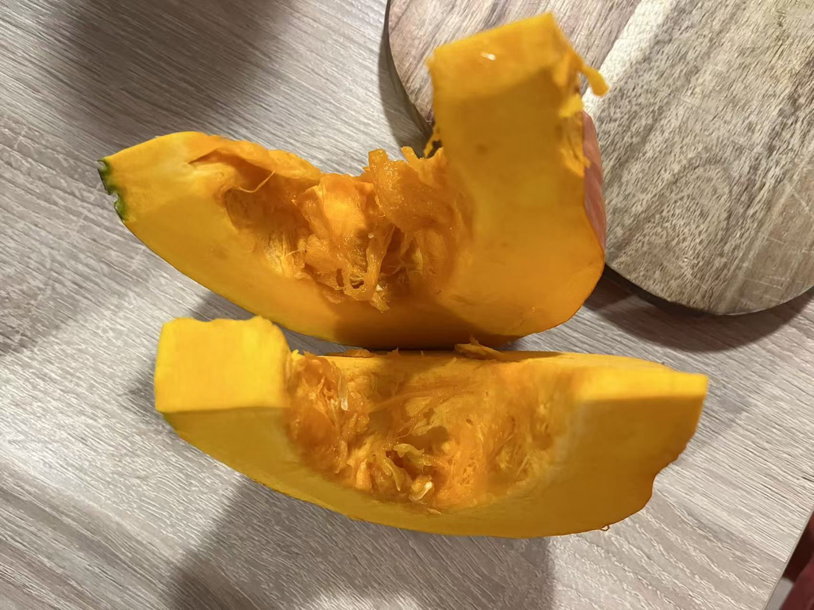
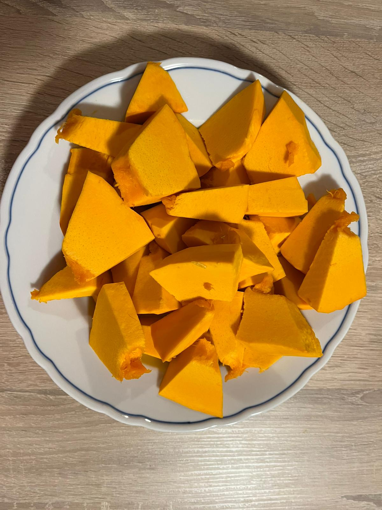
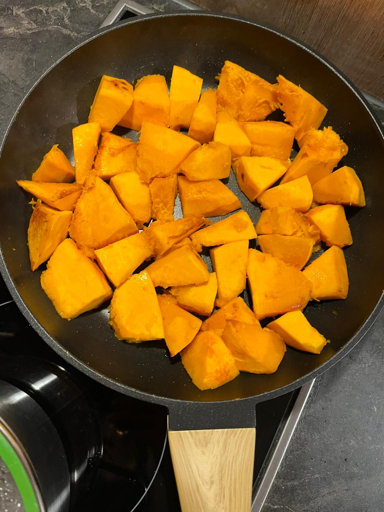
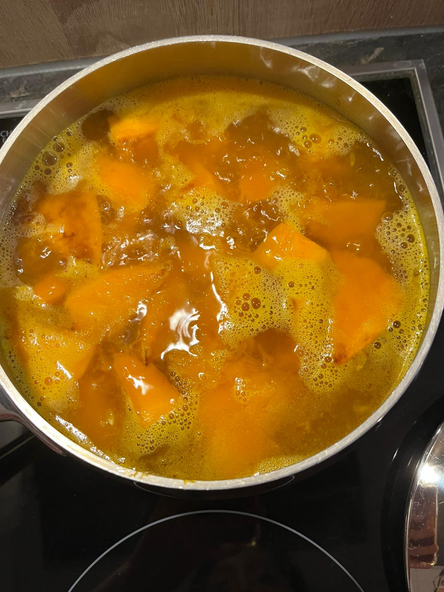

# 🥣 Kürbissuppe – Hausgemacht

Eine einfache, aromatische und wärmende Suppe aus frischem Kürbis – perfekt für kalte Tage.

## 🧄 Zutaten

- Ein halber Hokkaidokürbisse(runder oranger Kürbis)
- Etwas Öl zum Anbraten
- Wasser
- Salz
- Pfeffer
- Frühlingszwiebeln (in Ringe geschnitten)

---

## 👩‍🍳 Zubereitungsschritte

### 🥕 1️⃣ Kürbis vorbereiten

Den runden orangefarbenen Kürbis schälen, halbieren und die Kerne sowie Fasern entfernen.

---

### 🔪 2️⃣ In Stücke schneiden

Den geschälten Kürbis in gleichmäßige Stücke schneiden.

---

### 🍳 3️⃣ Anbraten

Etwas Öl in eine Pfanne geben und die Kürbisstücke darin anbraten, bis sie leicht gebräunt und weich sind.

---

### 🫕 4️⃣ Kochen

Die angebratenen Kürbisstücke in einen Topf geben, mit heißem Wasser bedecken und etwas Salz hinzufügen.  
Bei mittlerer Hitze kochen, bis der Kürbis weich ist.

---

### 🥄 5️⃣ Pürieren und abschmecken

Wenn der Kürbis weich ist, mit einem Löffel leicht zerdrücken oder pürieren, bis die Suppe cremig wird.  
Zum Schluss Salz, Pfeffer und Frühlingszwiebeln hinzufügen und gut umrühren.

---

## ✅ Fertig!

Die Kürbissuppe ist nun cremig, duftend und servierbereit.  
Am besten heiß genießen – eventuell mit etwas Brot dazu. 🥖
